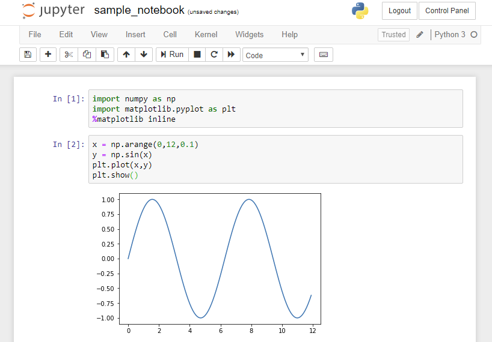
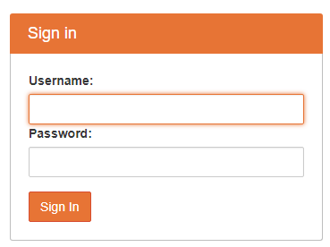
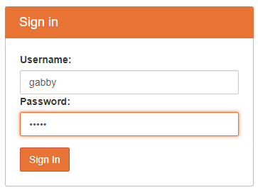

# Add Users

We have Nginx and JupyterHub running as system services. We can log into JupyterHub as the non-root sudo user ```peter```, the user we created when we first setup the server. In this section, we will add an additional user to the server and see if we can log in as that user. If you have a very small class or small lab, this may be all the users you need to register.

[TOC]

Adding new users to JupyterHub can be accomplished in a couple of different ways. Users can be added manually to the server from the command line, users can be added in JupyterHub with the Admin dashboard, and users can be added automatically when a user authenticates with a service like GitHub or Google.

In this section, we are going to add users to the server manually. We will create a new user on the server and then log into JupyterHub as the new user.

Open PuTTY and log into the server. Just to make sure, update the system before proceeding.

```text
$ sudo apt-get update
$ sudo apt-get upgrade
```

Shutdown JupyterHub and Nginx, then restart both of them. Let's make sure our system service functionality works correctly.

```text
$ sudo systemctl stop jupyterhub
$ sudo systemctl stop nginx

$ sudo systemctl start nginx
$ sudo systemctl status nginx
# check if active [Ctrl]+[c] to exit

$ sudo systemctl start jupyterhub
$ sudo systemctl status jupyterhub
# check if active [Ctrl]+[c] to exit
```

Point a web browser at our domain and log into JupyterHub as our non-root sudo user ```peter```. Use the password we set for ```peter``` on the server.

The JupyterHub login screen is shown below:


You should see a couple files in the Jupyter notebook file browser. These are the same files that are in the non-root sudo user's (```peter```) ```home``` directory.

At the Jupyter notebook file browser, choose [New] --> [Python 3]


Try writing a bit of Python code and running it. Imports for ```numpy``` and ```matplotlib``` should work normally.



After messing around with a Jupyter notebook and making sure that imports and plots work correctly, shut down your notebook server. This action does not shut down the Digital Ocean server running JupyterHub, it just shuts down the server (running on the Digital Ocean server) that serves Jupyter notebooks for the user you logged in as.

Click the [Control Pannel] button in the upper right-hand corner of the Jupyter notebook.


This brings you to a web browser screen that shows buttons for [Stop My Server] and [My Server] and [Logout]. Click the [Stop My Server] button.


Finally, logout by clicking the [Log Out] button in the upper right. This brings you back to the JupyterHub Sign in screen.



The reason we want to log out is that we are going to create a new user and want to login as that user. If you don't log out, JupyterHub may start you as the user ```peter```.

## Create a new user

If you have a small class or a small lab, creating users one at a time at the command line and assigning them passwords might be all you need to do to get JupyterHub working for your small group.

Next, we will create a new user on the server and log in as the new user. For a small group, you could repeat this process a couple times, and send out usernames and passwords to people in your group.

On the server, create the new user with the ```adduser``` command. I called my new user ```gabby```.

```text
$ sudo adduser gabby
```

Set a new password and confirm:

```text
Enter new UNIX password:
Retype new UNIX password:
passwd: password updated successfully
```

The user details can be skipped by pressing [Enter]. Then [Y] to complete the new user setup.

```text
Changing the user information for username
Enter the new value, or press ENTER for the default
    Full Name []:
    Room Number []:
    Work Phone []:
    Home Phone []:
    Other []:
Is the information correct? [Y/n]
```

## Add the new user to the jupyterhub_config.py file

Now we need to add the new user to the ```jupyterhub_config.py``` file. So far the only users we have specified in the file is ```peter```. Open up the ```jupyterhub_config.py``` file and edit the lines shown below.

```tet
$ nano /etc/jupyterhub/jupyterhub_config.py
```

Add  the user ```'gabby'``` to ```c.Authenticator.whitelist = { }```

```text
# /etc/jupyterhub/jupyterhub_config.py

...

# Users
c.Authenticator.whitelist = {'peter','gabby'}
c.Authenticator.admin_users = {'peter'}

...
```

Save and close the file with [Ctrl]+[x] and [y]. Now restart Jupyterhub to make the changes take effect.

```text
$ sudo systemctl stop jupyterhub
$ sudo systemctl start jupyterhub
$ sudo systemctl status jupyterhub
# [Ctrl]+[c] to exit
```

## Log to JupyterHub in as the new user

Now browse to the domain name we set up before and log into JupyterHub as the new user ```gabby```. Note the new user ```gabby``` doesn't have any files in their Jupyter notebook file browser. This is because the home directory of the user ```gabby``` is empty.




If you create a new notebook, that notebook will be saved in the ```gabby``` home directory. Make sure to stop the server and logout as we did before by clicking [Control Panel] in the upper right and selecting [Stop My Server] and [Logout].

## Summary

In this section, we tested our JupyterHub deployment and added a new user to the server. After the new user was created, we added the new user to the ```jupyterhub_config.py``` file. Then we restarted JupyterHub and logged in as our new user.

## Next Steps

The next step is to add Google authentication. This will allow students to log into our JupyterHub server with Google usernames and passwords.

<br>
