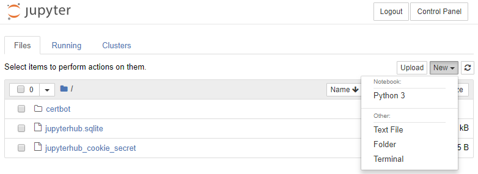

# Add Users

We have Nginx and JupyterHub running as system services. We can log into JupyterHub as the non-root sudo user we step up when we first created the server. In this section, we will add an additional user to the server and see if we can log in as that user. If you have a very small class or small lab, this may be all the users you need to register.

[TOC]

Adding new users to JupyterHub can be accomplished in a couple of different ways. Users can be added manually to the server from the command line, users can be added in JupyterHub with the Admin dashboard, and users can be added automatically when a user authenticates with a service like GitHub or Google.

In this section we are going to add users to the server manually. We will create a new user on the server and then log into JupyterHub as the new user.

Open PuTTY and log into the server. Just to make sure, update the system before proceeding.

```text
$ sudo apt-get update
$ sudo apt-get upgrade
```

Shutdown JupyterHub and Nginx, then restart both of them. Let's make sure our system service functionality works correctly.

```text
$ sudo systemctl stop nginx
$ sudo systemctl stop jupyterhub

$ sudo systemctl start nginx
$ sudo systemctl status nginx
# check if active [Ctrl]+[c] to exit

$ sudo systemctl start jupyterhub
$ sudo systemctl status jupyterhub
# check if active [Ctrl]+[c] to exit
```

Point a web browser at our domain and log into JupyterHub as our non-root sudo user ```peter``` and the password we set for ```peter``` on the server.

The JupyterHub login screen looks something should look like:


You should see a couple file in the Jupyter notebook file browser. These are the same files that are in the non-root sudo user's (```peter```) ```home``` directory.

At the Jupyter notebook file browser, choose [New] --> [Python 3]



Try writing a bit of Python code and running it. Imports for ```numpy``` and ```matplotlib``` should work normally.


## Create a new user

## Log to JupyterHub in as the new user

## Summary

In this section, we tested our JupyterHub deployment and added a new user to the server. After the new user was created, we logged in as our new user.

## Next Steps

The next step is to add Google authentication. This will allow students to log into our JupyterHub server with Google usernames and passwords.

<br>
