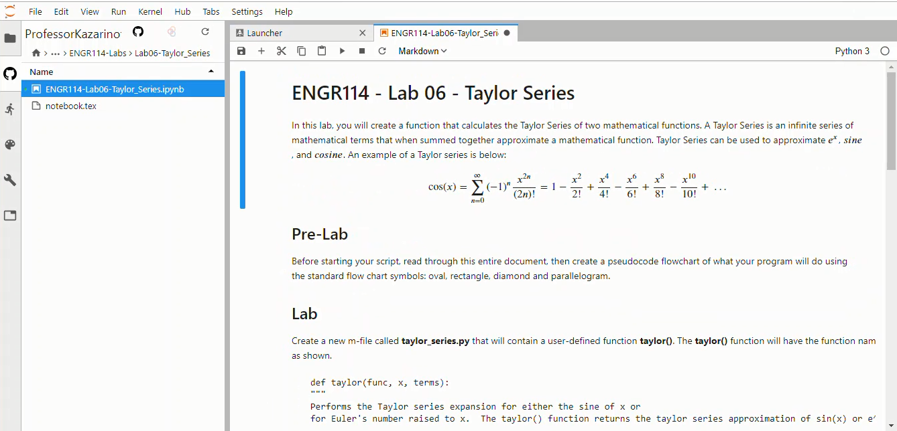

# GitHub Extension

It is possible put in a "GitHub" tab into each user's JupyterLab browser. When students click on the GitHub tab, they can view any repo on GitHub.com. Since the "labs" and "notes" for the course are saved on GitHub, a directory with pre-constructed lab assignments and notes (saved on GitHub) can be pulled in for each JupyterHub user.

Any public GitHub repo can be shown and accessed in JupyterLab using the GitHub tab once the GitHub extension for JupyterLab is installed.

[TOC]

## Install nodejs

To install the GitHub extension for JupyterHub, first log into the server and install nodejs with conda into the ```(jupyterhub)``` virtual environment.

```text
$ sudo systemctl stop jupyterhub
$ conda activate jupyterhub
(jupyterhub)$ conda install -c conda-forge nodejs
```

## Install GitHub extension for JupyterLab

Enter another conda install line to install the GitHub extension for
JupyterLab.

```text
(jupyterhub)$ jupyter labextension install @jupyterlab/github
```

## Restart JupyterHub and test it out

```text
$ sudo systemctl start jupyterhub
$ sudo systemctl status jupyterhub
[Ctrl]-[c] to exit
```




## Create notebook config file

In order for the GitHub tab in JupyterLab to arrive at a specific repo, a couple configuration steps are required.

First a notebook config file needs to be created. This notebook config file is different than the ```jupypterhub_config.py``` file we have been modifying during this JupyterHub deployment.

## Acquire GitHub token

The docs for the GitHub extension for JupyterLab note that a GitHub token should be acquired, otherwise there is a small limit to the number of requests that can be made to GitHub when the GitHub Tab in JupyterLab is used.

## Modify notebook config file

In the notebook config file (not the ```jupyterhub_config.py``` file):

```text
c.GitHubConfig.api_url = 'https://git.myserver.com/api/v3'
```

## pip install GitHub server extension

## Point JupyterHub to notebook config file

## Restart JupyterHub

```text
$ sudo systemctl start jupyterhub
$ sudo systemctl status jupyterhub
[Ctrl]+[c] to exit
```

## Summary

This docs page provided an overview of the GitHub extension for JupyterLab. The GitHub extension for JupyterLab adds a new tab in the JupyterLab interface that students can open and see what files are saved to a particular GitHub repo. The GitHub extension for JupyterLab first needs to be installed. After it is installed, there are some extra configuration steps to cause a specific repo to be the default repo when JupyterHub launches students into the JupyterLab interface and they select the GitHub tab.
