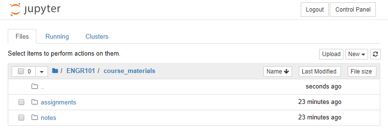
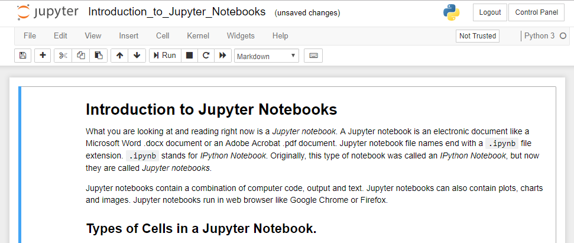

# nbgitpuller Plugin

In this section, we will install, enable and test the nbgitpuller plugin.

The [nbgitpuller plugin](https://github.com/jupyterhub/nbgitpuller#constructing-the-nbgitpuller-url) is a JupyterHub extension that pulls down a GitHub repo into each student's JupyterHub environment when students start JupyterHub by clicking on a specific link. 

The repo for the nbgitpuller plugin is here:

 > [https://github.com/jupyterhub/nbgitpuller#constructing-the-nbgitpuller-url](https://github.com/jupyterhub/nbgitpuller#constructing-the-nbgitpuller-url)

The link to the auto-generated URL construction app is here:

 > [https://jupyterhub.github.io/nbgitpuller/link](https://jupyterhub.github.io/nbgitpuller/link)

## Install the nbgitpuller plugin

To install the nbgitpuller plugin for JupyterHub, first log into the server and stop JupyterHub. Then activate the ```(jupyterhub)``` virtual environment and pip install the plugin. 

```text
$ sudo systemctl stop jupyterhub
$ conda activate jupyterhubenv
(jupyterhubenv)$ pip install nbgitpuller
```

After the nbgitpuller plugin is installed, the plugin needs to be enabled.

```text
(jupyterhubenv)$ jupyter serverextension enable --py nbgitpuller --sys-prefix
(jupyterhubenv)$ conda deactivate
$
```

After the ```serverextension enable``` command, Jupyter will validate the plugin. The output should look something like below:

```text
Enabling: nbgitpuller
- Writing config: /opt/miniconda3/envs/jupyterhub/etc/jupyter
    - Validating...
      nbgitpuller 0.6.1 OK
```

## Restart JupyterHub

After the plugin is installed and enabled, restart JupyterHub and check the status.

```text
$ sudo systemctl start jupyterhub
$ sudo systemctl status jupyterhub
[Ctrl]-[c] to exit
```

It's not a bad idea at this point to try and log into JupyterHub with a web browser and make sure everything still works the same as it did before we installed the nbgitpuller extension.

## Build custom URL

Go to the following link to the nbgitpuller URL builder app.

 > [https://jupyterhub.github.io/nbgitpuller/link](https://jupyterhub.github.io/nbgitpuller/link)

The URL building tool is shown below.


Note the ```tree/ENGR101/course_materials``` path shown in the [URL path] text box. Including ```tree/ENGR101/course_materials``` plops students into the ```course_materials``` directory of the ```ENGR101``` repo when the log into JupyterHub. 

Initially, I set the URL up so that students were dumped into the repo root. But I thought is looked a little confusing for the students to see the ```LICENSE```, ```README.md```, and ```requirements.txt``` files. So I put all the files I wanted students to see in a ```course_materials``` directory and routed them to the ```course_materials``` directory when Jupyterhub starts.  

## Go to the custom URL

Point a browser to the URL generated by the URL builder. The URL will be something like:

```text
https://engr101lab.org/hub/user-redirect/git-pull?repo=https%3A%2F%2Fgithub.com%2FProfessorKazarinoff%2FENGR101&urlpath=tree%2FENGR101%2Fcourse_materials
```

 First we see the login screen:

 

 Once logged in, we see the JupyterLab interface with all the folders and notebooks stored in the GitHub repo we specified.

 

 If we open one of the notebooks within JupyterHub, we see the same notebook that is stored on GitHub.

 

The cool thing is that if we modify any of the notes or assignments on GitHub, these modifications will show up when each user logs into JupyterHub. In addition, any files that students create which are not the same file name as files in the GitHub repo will persist on the server. So if a student creates their own file, it stays. But if the instructor upades a file, that update is applied. Pretty neat!

## Summary

In this section we installed the nbgitpuller plugin for JupyterHub. Then we created a custom URL. When we browse to the custom URL, we enter our JupyterHub environment with all the files contained on GitHub placed in our user directory. 

This is a great plugin to have with JupyterHub. Now when we make changes to the Labs or Assignments in the GitHub Repo, those changes are reflected when students log into JupyterHub with the special URL.

## Next Steps

Next, we'll configure JupyterHub to automatically go the the URL we setup with the nbgitpuller plugin. So when students go to ```domain.org``` they get the same files as if they went to the custom plugin URL ```https://mydomain.org/hub/user-redirect/git-pull?repo=GitHubUserName%2FRepoName&branch=master&app=lab```

